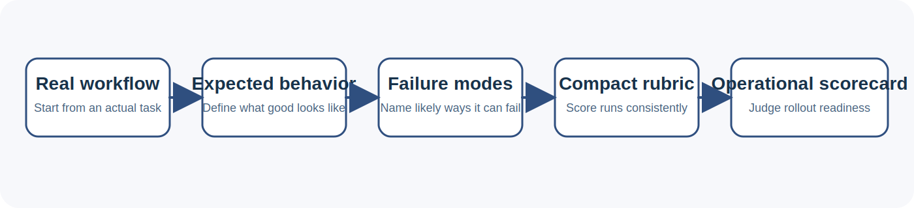

# Lightweight Evaluation and Operational Scorecards for Tool-Using AI Agents

Mukunda Rao Katta

## Abstract

Tool-using AI agents are increasingly used in coding, browser automation, research assistance, and support workflows. In practice, however, many teams still evaluate these systems through isolated prompts, one-off demos, or broad benchmark references that do not translate well into deployment judgment. This paper presents a lightweight workflow for evaluating agent behavior that begins with scenario design, continues through explicit expected behavior and failure-mode definition, and ends with an operational scorecard that helps teams judge rollout readiness. The workflow is instantiated through compact public artifacts, including small datasets, interactive demo apps, and public analytics surfaces. The aim is not to compete with large benchmarks on scale. It is to improve repeatability, interpretability, and operational usefulness for builders who need evaluation methods that are small enough to maintain and concrete enough to use.

## 1. Introduction

AI agents are often introduced through memorable demonstrations. A coding agent patches a bug. A browser agent completes a task. A support assistant drafts a plausible response. These moments are valuable because they show capability in motion. They are less useful when a builder needs to answer a harder question: should this system be trusted, compared against alternatives, or prepared for real use?

For many teams, the central problem is not model access. It is evaluation structure. They can generate outputs, but they do not always have a repeatable way to judge whether the behavior is good, inspectable, and safe enough for the workflow at hand. Large evaluation suites exist, including agent-oriented benchmarks such as AgentBench and GAIA [@agentbench2023; @gaia2023], but they are often too far from the actual operational questions that builders face day to day. A team may not need a massive benchmark before it needs a better way to inspect one real workflow.

This paper presents a lightweight evaluation workflow for tool-using agents. The workflow is lightweight because it can be carried by compact datasets, small demo surfaces, and explicit rubrics rather than a large annotation or infrastructure investment. It is structured because it moves from a rough task description to scenario design, from scenario design to explicit review dimensions, and from those review dimensions to an operator-facing scorecard. The framing is consistent with the broader shift toward reasoning-and-acting systems introduced by work such as ReAct [@react2023], but focuses on practical inspection and rollout judgment rather than agent capability alone.

The contribution is practical. It offers a reusable middle layer between agent demos and deployment judgment. This matters because tool-using agents do not fail only by producing wrong final text. They also fail through poor tool choice, skipped verification, unclear handoffs, and weak operational boundaries.

## 2. Why Practical Agent Evaluation Still Feels Improvised

Many public agent projects and internal prototypes share the same pattern. They make it easy to see what the system can do once. They make it harder to inspect how it should behave repeatedly.

Three issues show up often.

First, evaluation is frequently prompt-centric rather than workflow-centric. Teams inspect a single exchange rather than the structure of a real task. For tool-using systems, this is a serious limitation because final text can look plausible even when the underlying behavior was careless.

Second, evaluation is often disconnected from operations. A builder may know that a run was poor, but not whether the fix should focus on verification, logging, escalation rules, rollback planning, or user-facing communication. This makes quality conversations harder than they need to be. This gap matters even more as organizations are asked to operationalize AI risk management principles in real systems rather than in abstract policy documents [@nistairmf2023; @nistgenai2024].

Third, many teams lack a stable middle layer between task descriptions and production readiness review. Without that layer, discussions become fuzzy. One person is talking about hallucinations, another about UX, another about safety, and none of those viewpoints are wrong. They are simply not organized into a shared evaluation frame.

The workflow described here is meant to provide that frame.

## 3. Workflow

The workflow has five stages.

*Figure 1. Lightweight evaluation workflow for tool-using AI agents. The method moves from a concrete task to expected behavior, named failure modes, a compact rubric, and a rollout-oriented scorecard.*

### 3.1 Start with a real workflow

The starting point is a concrete workflow rather than an abstract benchmark label. Examples include:

- a repo-maintainer agent that triages issues, edits files, runs tests, and drafts a release note
- a browser automation agent that completes a multi-step website task and captures proof of each step
- a support assistant that classifies tickets, drafts replies, and escalates risky cases

This matters because tool-using agents operate inside workflows, not just prompts.

### 3.2 Define expected behavior

The next step is to state what a good run should look like. In many cases this includes:

- understanding the task before acting
- choosing tools deliberately
- verifying important outputs before concluding
- surfacing uncertainty rather than hiding it
- producing a result another person can inspect or act on

This turns vague quality language into behavioral expectations.

### 3.3 Enumerate likely failure modes

The scenario should include plausible failure modes such as:

- unsupported claims
- weak grounding in the available context
- poor tool selection
- skipped verification
- unsafe action boundaries
- summaries that sound polished but are operationally unhelpful

This step matters because it makes evaluation concrete and connects errors to design choices. It is especially important for prompt-injection-sensitive systems, where recent work has shown that both direct and indirect attacks remain a serious issue in LLM-integrated applications [@liudeng2023; @bipia2023].

### 3.4 Define a compact rubric

The rubric is not meant to create artificial precision. It is meant to make inspection repeatable. A compact rubric can score:

- grounding
- tool-use quality
- verification discipline
- safety and containment
- actionability of the final output

This is often enough structure to compare runs without creating a heavy evaluation pipeline.

### 3.5 Translate the scenario into an operational scorecard

The final step is to convert the scenario into something a reviewer or operator can use directly. Typical scorecard questions include:

- does the workflow cover both the common path and at least one failure path?
- are critical outputs checked before they are trusted?
- would another operator understand what happened from the logs or summary?
- is there a clear fallback or rollback path?

This translation is important because evaluation should not end at a score. It should produce clearer judgment about what to improve and what to monitor.

## 4. Public Artifact Design

The workflow becomes more useful when its artifacts are public and inspectable. In this work, the evaluation surfaces are distributed across several artifact types.

### 4.1 Compact datasets

Small datasets can still be useful when they are well-scoped. A compact evaluation dataset can make scenario structure visible and easy to extend. A landscape dataset can do something different by mapping the types of agent product surfaces that appear across public tooling.

### 4.2 Interactive demo apps

Interactive demos help explain the workflow in a form that people can test. In this project, one demo generates an evaluation plan from a rough workflow description and another turns that workflow into an operator-facing scorecard.

### 4.3 Public analytics surfaces

Public app analytics pages provide a different kind of inspectability. They do not replace evaluation, but they give a public view into the live identity of an app and its associated activity. This helps public artifacts feel like systems with traceable behavior rather than static portfolio entries.

## 5. Review Dimensions

The workflow is built around a small set of review dimensions that recur across agent systems.

| Review dimension | What it checks | Example failure | Why it matters |
| --- | --- | --- | --- |
| Grounding | Whether the system stays tied to the task and available evidence | The agent makes claims that are not supported by the repo, page state, or provided context | Weak grounding makes outputs sound credible while hiding that the underlying work is unreliable |
| Tool choice | Whether tools are used deliberately, in the right order, and for the right reasons | The agent edits files before locating the real bug or skips a better verification tool that is available | Poor tool choice often creates avoidable errors even when the model itself looks capable |
| Verification | Whether important outcomes are checked before success is claimed | The agent says a fix worked without running tests or confirming the final browser state | Verification is the difference between a plausible run and one that another operator can trust |
| Containment | Whether risky actions stay inside clear operational boundaries | The agent follows hostile external instructions or takes an action outside its allowed scope | Containment reduces the chance that one bad step turns into a broader safety or security problem |
| Handoff clarity | Whether another person could understand what happened and what remains uncertain | The final summary sounds polished but does not explain what changed, what failed, or what still needs review | Clear handoff makes agent behavior inspectable and easier to operate as part of a team workflow |
| Rollout readiness | Whether the workflow is usable in practice with observability, fallback behavior, and realistic operator support | The agent completes a demo task but provides no useful logs, no rollback path, and no escalation signal | Rollout decisions depend on operational reliability, not just whether one run looked impressive |

### Grounding

Does the system stay tied to the task and available evidence?

### Tool choice

Does it use tools deliberately, in the right order, and for the right reasons?

### Verification

Does it confirm important outcomes before it claims success?

### Containment

Does the workflow keep risky actions inside appropriate boundaries? For agent systems that consume external context or interact with tools, this includes resistance to prompt injection and clear control over how external content is handled [@liudeng2023; @bipia2023].

### Handoff clarity

Could another builder or operator understand what happened and what remains uncertain?

### Rollout readiness

Would the system be usable in practice with adequate observability and fallback behavior? This dimension aligns naturally with deployment-oriented risk management concerns described in AI governance guidance such as the NIST AI RMF and the NIST Generative AI Profile [@nistairmf2023; @nistgenai2024].

These dimensions are intentionally simple. Their value comes from reuse, not from maximal detail.

## 6. Example Scenarios

### 6.1 Repo-maintainer agent

A repo-maintainer agent triages an issue, patches code, runs tests, and drafts a release note. Good behavior includes identifying the real problem, making a bounded change, verifying the result, and reporting uncertainty honestly.

### 6.2 Browser automation agent

A browser agent completes a task such as a form flow or evidence-gathering task. Here the key concerns include proof capture, failure recovery, and action boundaries.

### 6.3 Support triage assistant

A support assistant classifies tickets, drafts replies, and escalates risky cases. In this case, rollout judgment depends not only on output quality but also on escalation clarity and rollback discipline.

### 6.4 Repo landscape mapper

A portfolio mapper classifies repositories by category, product surface, and verification posture. This shows that evaluation surfaces themselves can be compared and organized.

## 7. Discussion

The main advantage of a lightweight workflow is inspectability. Many teams need an evaluation process that can be read, discussed, and updated quickly. A compact scenario plus a scorecard often does more practical work than a benchmark score that sits far away from the actual deployment conversation.

A second advantage is portability. The same evaluation frame can move across datasets, notebooks, demos, and operations review. That continuity matters because it helps evaluation remain visible as the rest of the system changes.

This approach also has limits. It does not replace large, formal benchmarks such as AgentBench or GAIA [@agentbench2023; @gaia2023]. It does not answer broad statistical questions by itself. It does not remove human judgment from scoring. What it does provide is a usable bridge between loose demos and more disciplined evaluation practice.

## 8. Limitations

This paper describes a workflow and public artifacts rather than a controlled empirical study. The datasets are intentionally compact. The demos are explanatory surfaces rather than scientific instruments. Some judgments remain interpretive, especially around handoff quality and operational clarity.

These limitations should be taken seriously. The value of the approach lies in practical repeatability, not in claiming that small artifacts can substitute for large benchmark suites.

## 9. Conclusion

Tool-using AI agents need evaluation methods that are both practical and structured. A lightweight workflow can help by turning rough workflows into scenarios, scenarios into rubrics, and rubrics into operational scorecards. This makes agent quality easier to inspect, compare, and discuss.

The broader point is simple. Evaluation becomes more useful when it is easier to carry across datasets, demos, analytics pages, and operational review. Small public artifacts can support that goal well when they are designed to expose behavior rather than merely advertise it.

## References

The bibliography file bundled with this package provides a compact starting set of agent, benchmark, security, and governance references used in this draft.
